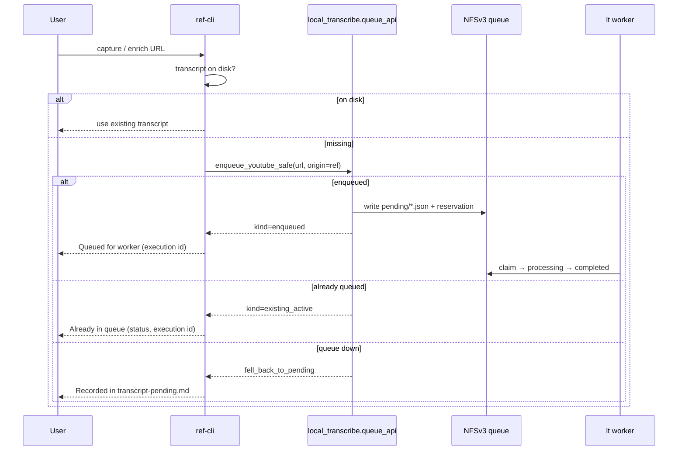

# local-transcribe queue integration (ref-cli)

**Audience:** ref-cli maintainers  
**Depends on:** [local-transcribe](https://github.com/draeician/local_transcribe) **≥ 0.5.0**  
**Primary hook today:** `src/ref_cli/cli.py` → `add_url_to_pending_file()`  
**Status:** Partial wiring exists (task 035 draft). This document specifies the complete contract, including **user-visible reporting when the source is already in the queue**.

---

## 1. Why this change is required

### Old model
When YouTube captions were unavailable / blocked, ref appended the URL to:

`~/references/transcripts/transcript-pending.md`

A human (or a separate `lt batch` run) later transcribed those URLs. That file is:

- Not multi-host safe
- Not deduplicated against in-flight work
- Invisible to the NFSv3 worker unless someone imports it (`lt queue import`)

### New model (local-transcribe 0.5.0+)
Transcription is **queue-first**:

| Role | Who | Responsibility |
|------|-----|----------------|
| **Producer** | ref-cli, `lt transcribe`, `lt batch`, other hosts | Enqueue only — never download/transcribe |
| **Worker** | One host with NLM lock (`lt worker`) | Download + Whisper + publish transcript JSON |
| **Storage** | Shared NFSv3 queue dir | Durable `pending` / `processing` / `completed` / `failed` / `retry` |

If ref keeps writing only to `transcript-pending.md`, new captures sit outside the worker loop and the operator backlog never drains through the queue.

### Ownership boundary
- **ref-cli** owns `references.md`, reconcile, enrichment, and user messaging.
- **local-transcribe** owns the queue, worker, downloads, and transcript JSON publish.
- local-transcribe **must never** rewrite `references.md`.
- Capture / enrich in ref **must not fail** solely because the queue or NFS is down — fall back to `transcript-pending.md`.

---

## 2. How ref-cli interacts with the queue

```text
ref capture / enrich
        │
        ▼
transcript already on disk? ──yes──► skip (existing behavior)
        │ no
        ▼
local_transcribe.queue_api.enqueue_youtube_safe(url, origin="ref", …)
        │
        ├─ success ──► EnqueueResult.kind (see §3) ──► report to user
        │
        └─ queue unavailable ──► append transcript-pending.md ──► report fallback
```

### Prerequisites on each producer host
1. Either:
   - `lt` on `PATH` (`pipx install git+https://github.com/draeician/local_transcribe.git`) — **preferred**; ref shells out to `lt queue add`, or
   - `local-transcribe` **0.5.0+** importable in the same environment as `ref`  
     (`pipx inject ref-cli git+https://github.com/draeician/local_transcribe.git` — pulls heavy deps into ref’s venv).
2. `~/.config/local-transcribe/config.yaml` with the same `queue.path` + `expected_uuid` as the worker host (written by `lt queue init` on the worker, then copied/synced to producer hosts).
3. Shared NFS mount for that queue path (and transcripts root, if shared).

If neither the import nor `lt` is available, ref falls back to `transcript-pending.md` and prints install instructions once.

ref does **not** start the worker. The GPU host runs:

```bash
systemctl --user enable --now local-transcribe-worker.service
```

### API to call (preferred)

```python
from pathlib import Path
from local_transcribe.queue_api import enqueue_youtube_safe

PENDING = Path.home() / "references" / "transcripts" / "transcript-pending.md"

outcome = enqueue_youtube_safe(
    url,
    origin="ref",
    priority=20,                 # interactive / capture priority
    pending_fallback=PENDING,
)
```

- Prefer **`enqueue_youtube_safe`** over bare `enqueue_youtube`.
- Bare `enqueue_youtube` raises on config/NFS errors; capture must not die for that.
- CLI equivalent for operators: `lt queue add "$URL" --origin ref --priority 20`.

---

## 3. Enqueue outcomes — **must report to the user**

`outcome.result` is an `EnqueueResult` with `.kind`, `.source_key`, `.execution`, `.message`, `.transcript_path`.

| `kind` | Meaning | User-facing message (recommended) |
|--------|---------|-----------------------------------|
| `enqueued` | New job created in `pending/` | `Queued for transcription (execution <id>). Worker will process it.` |
| `existing_active` | **Already in the queue** (`pending`, `processing`, or `retry`) | `Already in the transcription queue (<status>, execution <id>). No duplicate added.` |
| `already_completed` | Valid transcript already present (when checker used) | `Transcript already available at <path>.` |
| `requires_force` | Prior `failed`/`cancelled` blocks re-enqueue | `Previously failed/cancelled in queue; re-queue with force or \`lt queue retry --source youtube:<id>\`.` |
| *(fallback)* | `outcome.fell_back_to_pending` | `Queue unavailable (<error>); recorded in transcript-pending.md instead.` |

### Critical UX requirement
When `kind == "existing_active"`, ref **must tell the user the URL is already queued** — not silently return, and **not** claim it was newly added to `transcript-pending.md`.

Suggested helper:

```python
def format_queue_enqueue_message(outcome) -> str:
    if outcome.fell_back_to_pending:
        err = outcome.error or "queue unavailable"
        return (
            f"Transcript unavailable (queue offline: {err}; "
            f"recorded in transcript-pending.md)"
        )
    result = outcome.result
    if result is None:
        return "Transcript unavailable (queue enqueue failed)"

    ex = result.execution
    eid = ex.execution_id if ex else "?"
    status = ex.status if ex else "?"

    if result.kind == "enqueued":
        return (
            f"Transcript unavailable (queued for local-transcribe worker; "
            f"execution {eid})"
        )
    if result.kind == "existing_active":
        return (
            f"Transcript unavailable (already in transcription queue: "
            f"{status}, execution {eid})"
        )
    if result.kind == "already_completed":
        path = result.transcript_path or "on disk"
        return f"Transcript already completed ({path})"
    if result.kind == "requires_force":
        return (
            "Transcript unavailable (queue has a failed/cancelled job for this "
            "source; use lt queue retry or force re-enqueue)"
        )
    return f"Transcript unavailable (queue: {result.kind})"
```

Wire this into `format_transcript_failure()` / any path that currently hard-codes:

```text
Transcript unavailable (queued in transcript-pending.md)
```

That string is **wrong** once the durable queue is the primary path.

Also log at INFO with `kind`, `execution_id`, and `source_key` for operators.

---

## 4. What to change in ref-cli

### 4.1 `add_url_to_pending_file` (`src/ref_cli/cli.py`)

**Today (gaps):**
- Calls `enqueue_youtube` (raises) instead of `enqueue_youtube_safe`.
- Logs `result.kind` but does not surface `existing_active` to the end user.
- User-facing failure text still says `transcript-pending.md` even when the durable queue succeeded.
- Fallback append format may not match local-transcribe’s markdown `- url` style (prefer using `append_pending_url` from `queue_api`, or keep ref’s format consistently).

**Required behavior:**

1. If `video_id` and transcript JSON already on disk → skip (unchanged).
2. Call `enqueue_youtube_safe(..., pending_fallback=TRANSCRIPT_PENDING_FILE)`.
3. Return or propagate enough info for the caller to print §3 messages (either return `SafeEnqueueOutcome`, or set a thread-local / return a small result dataclass — today the function returns `None`).
4. On `existing_active` / `enqueued` / etc., **do not** also append to `transcript-pending.md`.
5. Only use the pending file when `fell_back_to_pending` is true (or `ImportError` before the API exists).

**Suggested signature upgrade:**

```python
@dataclass
class PendingQueueResult:
    action: str  # enqueued | existing_active | already_completed | requires_force | pending_file | skipped_on_disk
    message: str
    execution_id: str | None = None
    source_key: str | None = None

def add_url_to_pending_file(url: str, video_id: str | None = None) -> PendingQueueResult:
    ...
```

Call sites that currently ignore the return value should print `result.message` (or fold it into `format_transcript_failure`).

### 4.2 User-visible strings

| Location | Change |
|----------|--------|
| `format_transcript_failure` | Use queue-aware wording from §3 |
| `enrichment.py` matchers for `'queued in transcript-pending'` | Also accept the new phrases (or a stable token like `queued for local-transcribe`) |
| `tests/test_transcript_blocking.py` / `test_enrichment.py` | Update expected strings; add cases for `existing_active` |

### 4.3 Packaging / runtime

Document for operators:

```bash
# After installing/upgrading both tools
pipx inject ref-cli local-transcribe
# or reinstall ref against an env that already has local-transcribe 0.5.0+
```

Without inject, `ImportError` → silent fallback to the pending file forever.

### 4.4 Optional: pre-check without enqueue

If you want a read-only “is it already queued?” before enqueue, you can shell out or call:

```bash
lt queue show-source youtube:VIDEO_ID
```

Enqueue itself already performs reservation / active-job checks and returns `existing_active`, so a separate pre-check is **optional**. Prefer trusting `EnqueueResult.kind` to avoid races.

### 4.5 Do **not**
- Start or stop the transcription worker from ref.
- Put cookie contents or YouTube API keys into queue job JSON (worker uses local `auth_profiles`).
- Treat YouTube Data API key as download auth — it is unrelated to yt-dlp / the worker.
- Rewrite queue files from ref except via the public `queue_api`.

---

## 5. Interaction summary (sequence)



---

## 6. Acceptance checklist

- [x] `local-transcribe>=0.5.0` importable from the ref runtime (`pipx inject` documented).
- [x] `add_url_to_pending_file` uses `enqueue_youtube_safe` with pending fallback.
- [x] When source is already `pending`/`processing`/`retry`, user sees **“already in the transcription queue”** (with status + execution id when available).
- [x] New enqueue reports **queued for worker**, not “queued in transcript-pending.md”.
- [x] Fallback path still writes pending file and says so explicitly.
- [x] Enrichment / tests updated for new message strings.
- [ ] Manual smoke:
  1. `ref` capture a URL with no captions → message shows enqueued + id.
  2. Capture the **same** URL again → message shows `existing_active` / already in queue.
  3. Stop NFS / break queue config → message shows pending-file fallback; capture still succeeds.

---

## 7. References

| Doc | Location |
|-----|----------|
| Queue operator guide | `local_transcribe` → `docs/QUEUE_OPERATOR.md` |
| Short adapter contract | `local_transcribe` → `docs/REF_CLI_QUEUE_ADAPTER.md` |
| Public API | `local_transcribe` → `src/local_transcribe/queue_api.py` |
| Enqueue kinds | `local_transcribe` → `services/queue_store.py` (`EnqueueResult`) |
| Release | local-transcribe **v0.5.0** |

---

## 8. Minimal patch sketch

```python
# src/ref_cli/cli.py  (conceptual)

def add_url_to_pending_file(url: str, video_id: Optional[str] = None) -> PendingQueueResult:
    if video_id and transcript_exists_on_disk(video_id):
        return PendingQueueResult("skipped_on_disk", f"Transcript already on disk for {video_id}")

    try:
        from local_transcribe.queue_api import enqueue_youtube_safe
    except ImportError:
        _append_pending_file(url)
        return PendingQueueResult(
            "pending_file",
            "Transcript unavailable (local-transcribe not installed; recorded in transcript-pending.md)",
        )

    outcome = enqueue_youtube_safe(
        url,
        origin="ref",
        priority=20,
        pending_fallback=Path(TRANSCRIPT_PENDING_FILE),
    )
    msg = format_queue_enqueue_message(outcome)
    # logging.info(msg)
    action = (
        "pending_file"
        if outcome.fell_back_to_pending
        else (outcome.result.kind if outcome.result else "pending_file")
    )
    eid = (
        outcome.result.execution.execution_id
        if outcome.result and outcome.result.execution
        else None
    )
    return PendingQueueResult(action, msg, execution_id=eid,
                              source_key=(outcome.result.source_key if outcome.result else None))
```

Callers that build the reference row’s transcript placeholder should use `PendingQueueResult.message` instead of a hard-coded pending-file string.
